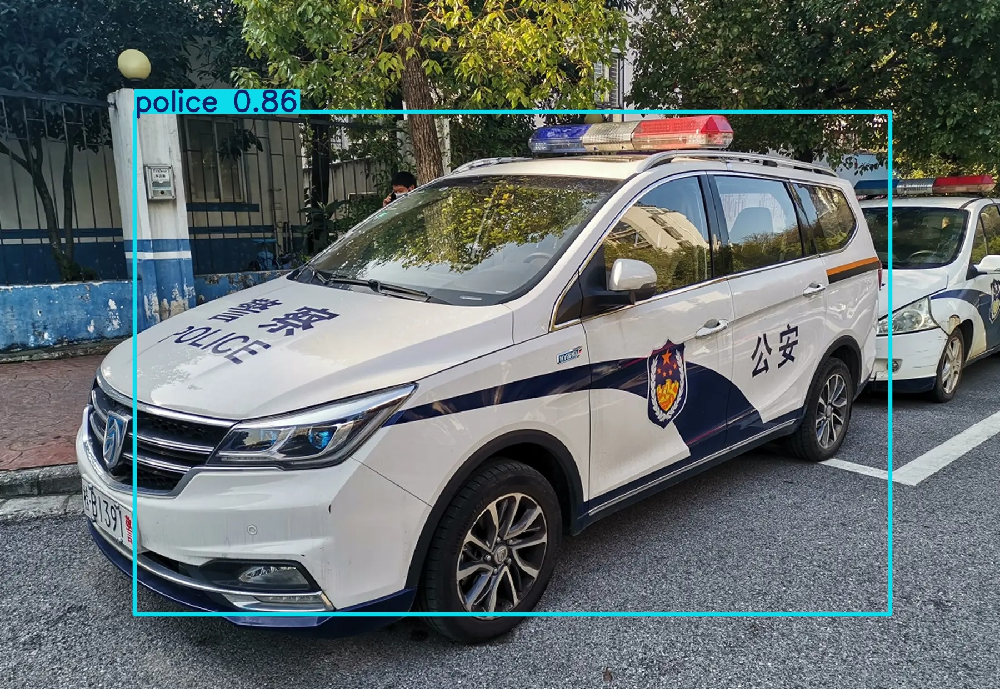
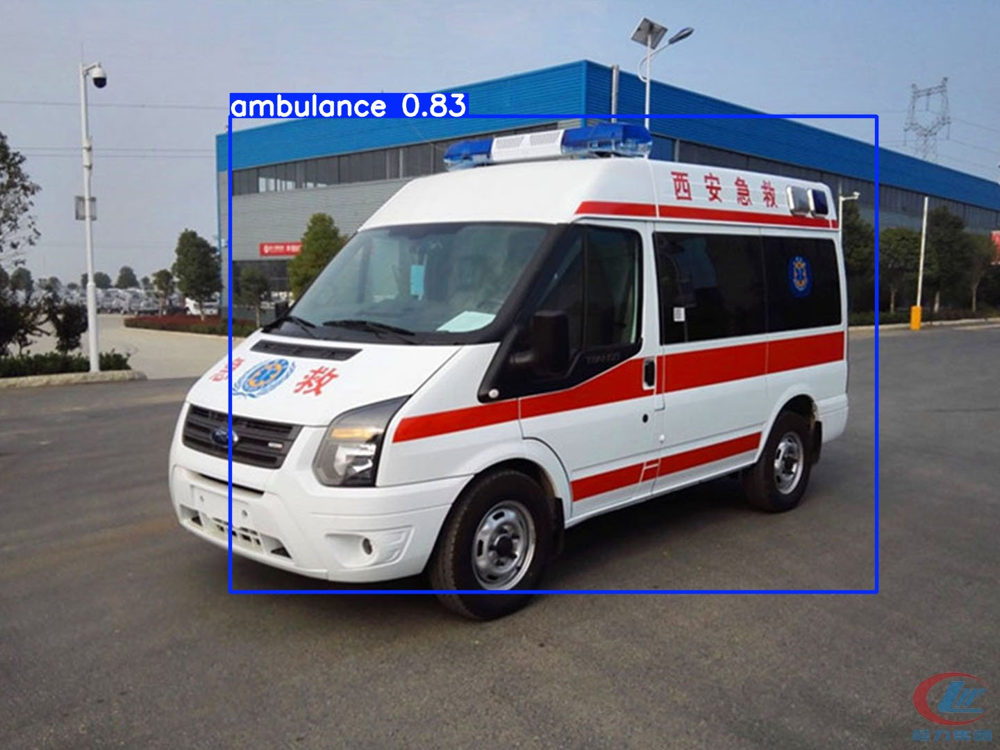
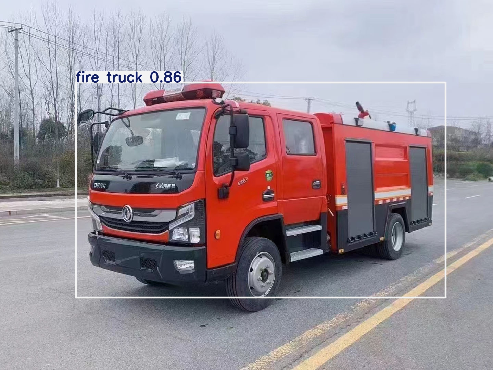

# smart-traffic-yolo
智能交通 | 基于 YOLOv8 的紧急车辆检测系统

## 项目介绍
本项目使用 YOLOv8n 训练实现对紧急车辆的实时检测，可应用于智慧路口、车路协同、应急优先通行等场景。

## 检测类别
- 0: ambulance 救护车
- 1: police 警车
- 2: fire truck 消防车

## 模型信息
- 模型：YOLOv8n
- 训练轮数：50 epochs
- 训练环境：CPU
- 数据集：314 张标注图片

## 功能
- 批量识别图片
- 输出带标注框的检测结果
- 可直接部署用于智能交通项目
- ## 项目效果

### 🚓 警车识别（Police Detection）

- 成功识别 police，置信度 0.92
- 在复杂背景下仍能稳定检测

### 🚑 救护车识别（Ambulance Detection）

- 支持多目标检测
- 可用于紧急车辆优先通行判断

### 🚒 消防车识别（Fire Truck Detection）

- 能区分普通车辆与特种车辆
- 提供交通调度关键输入数据

- 💡 本系统可扩展用于：
- 应急车辆优先通行控制
- 智能交通信号优化
- 城市交通监测与调度

## 使用方法
```python
from ultralytics import YOLO

# 加载模型
model = YOLO("best.pt")

# 识别图片
results = model("test.jpg")
results[0].save("result.jpg")
## 效果展示



